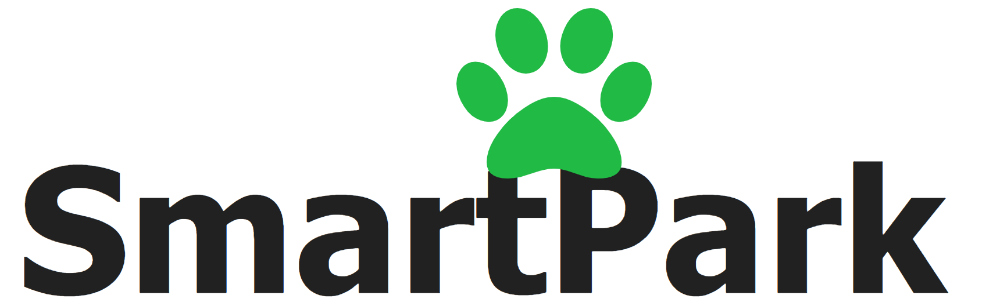

# SmartPark

## Project Overview

Smart Park is an exciting and actively developed full-stack application that aims to enhance the interactions between different dog owners. This project is designed with the goal of creating a seamless and enjoyable experience for both dogs and their owners when they visit the park. We're committed to creating a user-friendly and innovative platform that brings dog owners closer together and makes each visit to the park more enjoyable. Join us on this journey as we continue to develop and improve Smart Park!

  
  
  

## Table of Contents
 - [Installation & Getting Started](#installation--getting-started)
 - [Key Features](#key-features)
 - [Collaborators](#collaborators)

## Installation & Getting Started

This installation process assumes that you are not using a Windows Operating System. 

To clone and run this application, you'll need Git, Node.js (which comes with npm), Python, and SQLITE3 installed on your computer. 

### To start the frontend from your command line:

        <!-- Clone this repository -->
        $ git clone git@github.com:bryn-morris/Smart-Park.git

        <!-- Go into the repository -->
        $ cd Smart-Park/client

        <!-- Install dependencies -->
        $ npm install

        <!-- Run the app -->
        $ npm start

### To start the backend from your command line

        <!-- Go into the repository -->
        $ cd Smart-Park/server

        <!-- Install Dependencies and create virtual environment -->

        pipenv install && pipenv shell

        <!-- Run the app -->

        python app.py

Then open http://localhost:4000 in your browser.
After starting the app, you will be taken to the login page.

## Key Features 

### Currently Implemented

Smart Park offers users the ability to log in and efficiently manage their dogs and dog park visits. Some of the core user actions avaliable include:

 - Creating a User Account that can contain information about their dogs and favorite parks
 - Exploring available dog parks.
 - Checking in and out of a dog park.
 - Writing and reading reviews for dog parks.
 - Adding and editing dogs within their user account.

### In Development

**Real-time Communication:** Smart Park leverages the power of real-time websocket communication through Socket.io. This feature allows dog owners at the park to connect, share experiences, and arrange playdates for their furry friends. (Currently in Development)

### Future Development

**Push Notifications:** 

In the near future, we plan to implement push notifications through Twilio. This will enable users to receive important updates and alerts related to their park visits, ensuring they never miss out on exciting events or gatherings.

**Location Services:** 

Smart Park will utilize the Google Places API to provide users with valuable information about nearby parks, pet-friendly amenities, and other relevant data to enhance their park experience. 

**Enhanced Database Integration**: 

As part of our ongoing development efforts, we are planning to enhance our database system by transitioning from SQLITE3 to Postgres. This upgrade will unlock a range of new possibilities, including the integration of UUIDs into database columns. These improvements will empower us to implement advanced features and ensure a more robust and scalable foundation for Smart Park.

## Collaborators

Meet the talented individuals that have contributed to Smart Park:

- [**Damon Butler**](https://github.com/DamonButler)
  - *Full-stack developer*

- [**Beau Kim**](https://github.com/chasecivillion)
  - *Full-stack developer*

- [**Madaline Fitzpatrick**](https://github.com/madalinefitz)
  - *Full-stack developer*

